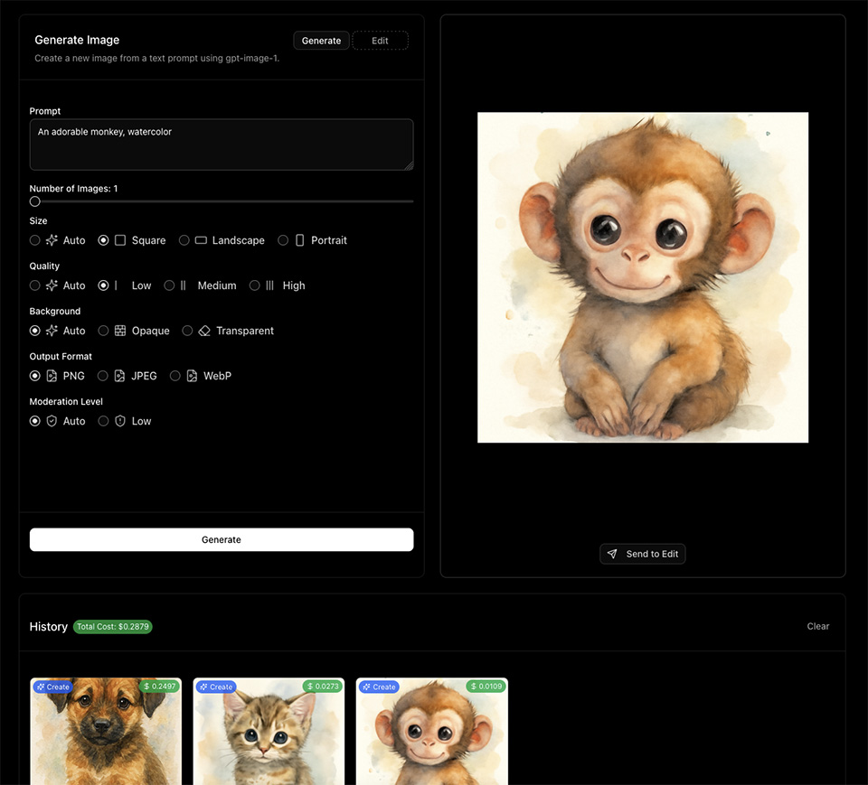
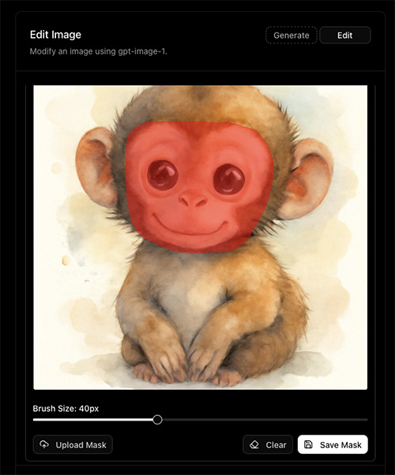
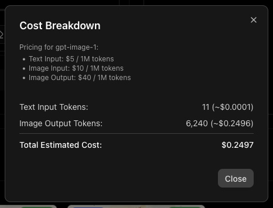

#  GPT-IMAGE-1 Playground

A web-based playground to interact with OpenAI's `gpt-image-1` model for generating and editing images.

<p align="center">
  
</p>

## ✨ Features

*   **🎨 Image Generation Mode:** Create new images from text prompts.
*   **🖌️ Image Editing Mode:** Modify existing images based on text prompts and optional masks.
*   **⚙️ Full API Parameter Control:** Access and adjust all relevant parameters supported by the OpenAI Images API directly through the UI (size, quality, output format, compression, background, moderation, number of images).
*   **🎭 Integrated Masking Tool:** Easily create or upload masks directly within the editing mode to specify areas for modification. Draw directly on the image to generate a mask.

     > ⚠️ Please note that `gpt-image-1`'s masking feature does not guarantee 100% control at this time. <br>1) [It's a known & acknowledged model limitation.](https://community.openai.com/t/gpt-image-1-problems-with-mask-edits/1240639/37) <br>2) [OpenAI are looking to address it in a future update.](https://community.openai.com/t/gpt-image-1-problems-with-mask-edits/1240639/41)
<p align="center">
  
</p>

*   **📜 Detailed History & Cost Tracking:**
    *   View a comprehensive history of all your image generations and edits.
    *   See the parameters used for each request.
    *   Get detailed API token usage and estimated cost breakdowns (`$USD`) for each operation. (hint: click the `$` amount on the image)
    *   View the full prompt used for each history item.
    *   View total historical API cost.
    *   Delete items from history

<p align="center">
  
</p>

<p align="center">
  
</p>

*   **🖼️ Flexible Image Output View:** View generated image batches as a grid or select individual images for a closer look.
*   **🚀 Send to Edit:** Quickly send any generated or history image directly to the editing form.
*   **📋 Paste to Edit:** Paste images directly from your clipboard into the Edit mode's source image area.
*   **💾 Storage:** Supports two modes via `NEXT_PUBLIC_IMAGE_STORAGE_MODE`:
    *   **Filesystem (default):** Images saved to `./generated-images` on the server.
    *   **IndexedDB:** Images saved directly in the browser's IndexedDB (ideal for serverless deployments).
    *   Generation history metadata is always saved in the browser's local storage.

## ▲ Deploy to Vercel

🚨 *CAUTION: If you deploy from `main` or `master` branch, your Vercel deployment will be **publicly available** to anyone who has the URL. Deploying from other branches will require users to be logged into Vercel (on your team) to access the preview build.* 🚨

You can deploy your own instance of this playground to Vercel with one click:

[](https://vercel.com/new/clone?repository-url=https://github.com/alasano/gpt-image-1-playground&env=OPENAI_API_KEY,NEXT_PUBLIC_IMAGE_STORAGE_MODE,APP_PASSWORD&envDescription=OpenAI%20API%20Key%20is%20required.%20Set%20storage%20mode%20to%20indexeddb%20for%20Vercel%20deployments.&project-name=gpt-image-playground&repository-name=gpt-image-playground)

You will be prompted to enter your `OPENAI_API_KEY` and `APP_PASSWORD` during the deployment setup. For Vercel deployments, it's required to set `NEXT_PUBLIC_IMAGE_STORAGE_MODE` to `indexeddb`. 

Note: If `NEXT_PUBLIC_IMAGE_STORAGE_MODE` is not set, the application will automatically detect if it's running on Vercel (using the `VERCEL` or `NEXT_PUBLIC_VERCEL_ENV` environment variables) and default to `indexeddb` mode in that case. Otherwise (e.g., running locally), it defaults to `fs` mode. You can always explicitly set the variable to `fs` or `indexeddb` to override this automatic behavior.

## 🚀 Getting Started [Local Deployment]

Follow these steps to get the playground running locally.

### Prerequisites

*   [Node.js](https://nodejs.org/) (Version 20 or later required)
*   [npm](https://www.npmjs.com/), [yarn](https://yarnpkg.com/), [pnpm](https://pnpm.io/), or [bun](https://bun.sh/)

### 1. Set Up API Key 🟢

You need an OpenAI API key to use this application. 

⚠️ [Your OpenAI Organization needs to be verified to use `gpt-image-1`](https://help.openai.com/en/articles/10910291-api-organization-verification)

1.  If you don't have a `.env.local` file, create one.
2.  Add your OpenAI API key to the `.env.local` file:

    ```dotenv
    OPENAI_API_KEY=your_openai_api_key_here
    ```

    **Important:** Keep your API key secret. The `.env.local` file is included in `.gitignore` by default to prevent accidental commits.

---

#### 🟡 (Optional) IndexedDB Mode (for serverless hosts) [e.g. Vercel]

For environments where the filesystem is read-only or ephemeral (like Vercel serverless functions), you can configure the application to store generated images directly in the browser's IndexedDB using Dexie.js.

Set the following environment variable in your `.env.local` file or directly in your hosting provider's UI (like Vercel):

```dotenv
NEXT_PUBLIC_IMAGE_STORAGE_MODE=indexeddb
```

When this variable is set to `indexeddb`:
*   The server API (`/api/images`) will return the image data as base64 (`b64_json`) instead of saving it to disk.
*   The client-side application will decode the base64 data and store the image blob in IndexedDB.
*   Images will be served directly from the browser's storage using Blob URLs.

If this variable is **not set** or has any other value, the application defaults to the standard behavior of saving images to the `./generated-images` directory on the server's filesystem.

**Note:** If `NEXT_PUBLIC_IMAGE_STORAGE_MODE` is not set, the application will automatically detect if it's running on Vercel (using the `VERCEL` or `NEXT_PUBLIC_VERCEL_ENV` environment variables) and default to `indexeddb` mode in that case. Otherwise (e.g., running locally), it defaults to `fs` mode. You can always explicitly set the variable to `fs` or `indexeddb` to override this automatic behavior.

#### 🟡 (Optional) Use a Custom API Endpoint

If you need to use an OpenAI-compatible API endpoint (e.g., a local model server or a different provider), you can specify its base URL using the `OPENAI_API_BASE_URL` environment variable in your `.env.local` file:

```dotenv
OPENAI_API_KEY=your_openai_api_key_here
OPENAI_API_BASE_URL=your_compatible_api_endpoint_here
```

If `OPENAI_API_BASE_URL` is not set, the application will default to the standard OpenAI API endpoint.

---


#### 🟡 (Optional) Enable Password Validation
```dotenv
APP_PASSWORD=your_password_here
```
When `APP_PASSWORD` is set, the frontend will prompt you for a password to authenticate requests.
<p align="center">
  
</p>

---

### 2. Install Dependencies 🟢

Navigate to the project directory in your terminal and install the necessary packages:

```bash
npm install
# or
# yarn install
# or
# pnpm install
# or
# bun install
```

### 3. Run the Development Server 🟢

Start the Next.js development server:

```bash
npm run dev
# or
# yarn dev
# or
# pnpm dev
# or
# bun dev
```

### 4. Open the Playground 🟢

Open [http://localhost:3000](http://localhost:3000) in your web browser. You should now be able to use the gpt-image-1 Playground!

## 🤝 Contributing

Contributions are welcome! Issues and feature requests, not as much welcome but I'll think about it.

## 📄 License

MIT
